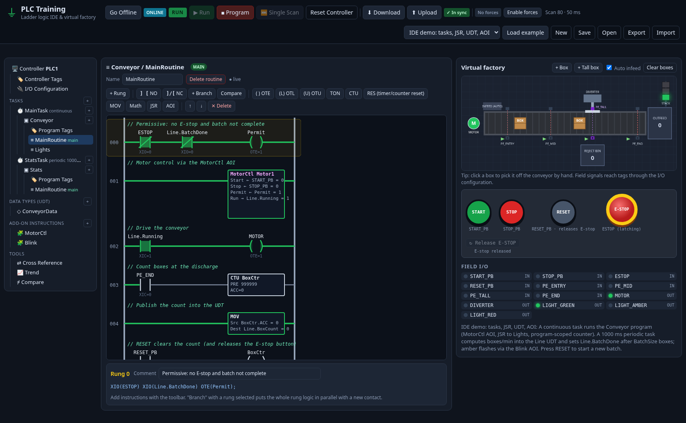

# plc-training

**Live app: https://forgetfulanthropod.github.io/plc-training/**

A browser-based PLC training IDE. Organise a project the way a Logix-style controller does, write ladder logic, download it to a simulated controller, go online to watch it drive a virtual conveyor factory, and use the usual tools: force, toggle, trend, cross reference and compare. Everything runs client-side as static files, with no install and no backend.



## Features

### Project organisation
- **Project tree:** Controller → Tasks → Programs → Routines, plus Controller Tags, I/O Configuration, Data Types, Add-On Instructions, and Tools.
- **Tasks:** *continuous* tasks run every 50 ms scan, while *periodic* tasks run at their own period, and timers inside them advance by that period.
- **Programs:** each program has its own program-scoped tags and a **main routine**. The main routine calls other routines with **JSR**. Recursive JSR is caught and faults the controller instead of hanging.
- **Tag scopes:** controller tags are global, and program tags are local to one program and shadow controller tags with the same name. Both are edited in the **tag editor**, which has data type, initial value, description, live value, force, toggle, cross-reference count, and an add-to-trend button. Struct tags expand to show their members.
- **Data types:** `BOOL`, `INT` (16-bit, wraps), `DINT` (32-bit), `REAL`, `TIMER`, and `COUNTER`, plus **user-defined types (UDTs)** with nested members accessed with dots, e.g. `Line.BoxCount` or `Tank.Level`.
- **Add-On Instructions (AOIs):** reusable instructions with Input/Output parameters, private local tags (including TIMER/COUNTER), and their own ladder logic. Each call uses an instance tag, so instances are independent. The demo includes `MotorCtl` (start/stop/permissive seal-in) and `Blink` (a two-timer flasher).

### Ladder editor
- **Input instructions:** `XIC`/`XIO` contacts (NO/NC), nested parallel branches, and compares (`EQU NEQ GRT GEQ LES LEQ`) whose operands can be tags or numbers.
- **Output instructions:** `OTE OTL OTU TON CTU`, `RES (timer/counter reset)`, `MOV`, `ADD SUB MUL DIV`, `JSR`, and AOI calls.
- **Editing:** an inspector for each instruction, tag autocomplete (including members such as `T1.DN` and `Motor1.Run`), and a one-click **Declare** for undeclared tags. Each rung also shows its mnemonic text, e.g. `[XIC(START_PB),XIC(MOTOR)] XIO(STOP_PB) OTE(MOTOR);`.

### Controller, online/offline
- **Download** sends the offline project to the simulated controller and switches it to PROGRAM mode. **Upload** pulls the running copy, with current tag values, back into the offline project.
- **Run / Program / Single Scan / Reset Controller.** Reset Controller restores memory to the downloaded initial values. It is separate from the `RES` instruction.
- **Go Online** shows energized wires and closed contacts, live values inside instruction blocks, and live tag values. If the offline project differs from the controller, a banner offers Download, Upload, or Compare, and only routines that match are highlighted live.
- **Compare** lists every difference between the offline project and the controller copy, down to individual rungs (shown as mnemonic text): tags, data types, AOIs, I/O mapping, tasks, programs, and routines.
- **Cross reference** shows every place a tag is read or written, including I/O module mappings. Click a usage to jump to that rung.
- **Force and toggle:** force BOOL or numeric controller-scope tags (inputs, outputs or internal), then enable or disable all forces at once. Forces are saved with the project and survive reloads. A flashing **FORCES ACTIVE** badge and an amber bar under the toolbar show when they are in effect. Toggle flips a BOOL in the running controller.
- **Trend:** a strip chart of up to six tags, sampled every scan, with 10, 30 or 60 s windows and pause/clear.
- **Verify:** the Controller view lists undeclared tags, missing JSR targets, and unknown AOIs.

### I/O configuration
Two modules are configured: slot 1 is a `1756-IB16` 16-point DC input module and slot 2 is a `1756-OB16` DC output module. Every field device is wired to a channel such as `Local:1:I.Data.0`, and each channel maps to a tag that you can change. All factory signals pass through this table. Inputs are copied to tags at the start of each scan, and output tags are copied to the field at the end.

### Virtual factory
- **Equipment:** a conveyor (`MOTOR`), an infeed spawner, photo-eyes `PE_ENTRY`, `PE_MID` and `PE_END`, a `PE_TALL` height sensor, a `DIVERTER` pusher with a reject bin, and a red/amber/green stack light.
- **Operator panel:** START, STOP and RESET pushbuttons, plus a latching E-STOP.
- **Taps:** a quick tap of a pushbutton is latched until at least one scan has read it, so taps between scans are never missed.
- **E-STOP:** it hard-cuts motor and diverter power. Release it with **RESET**, the labelled **↻ Release E-STOP** button, or a second click.

### Guided tour

The first time you visit, a short guided tour starts. It highlights one part of the IDE at a time, dims the rest of the screen and shows a caption with **Back**, **Next** and **Skip** buttons (the last step shows **Finish**). If a step's target is in a view that isn't open, such as Tags, I/O, Cross Reference or Trend, the tour switches to that view first. When the tour ends it goes back to the view you were on.

| # | Step | Highlights |
|---|------|------------|
| 1 | Project tree | the controller, tasks, programs, routines, UDTs and AOIs |
| 2 | Ladder editor | the routine toolbar and the rungs |
| 3 | Tags | the Controller Tags table |
| 4 | I/O configuration | module, channel and tag mapping |
| 5 | Run / Program / Single Scan | the controller mode buttons |
| 6 | Virtual factory | the conveyor cell and the operator buttons |
| 7 | Online and Download/Upload | Go Online, the online and sync badges, Download and Upload |
| 8 | Cross reference | where each tag is used |
| 9 | Forces | the Force column, Enable forces and the forces badge |
| 10 | Trend | the trend chart and its pens |

* Press <kbd>Esc</kbd> to skip, and use <kbd>←</kbd>/<kbd>→</kbd> to go back and forward. The highlight repositions when the window is resized or scrolled.
* The tour stores `plc-training:tourDone` in localStorage when you finish or skip it, so it won't start again on its own. If you close the tab partway through, it shows again next time.
* Click **? Tour** in the top bar to replay it at any time.
* The tour is written in plain JS with no library. The step and flag logic in `js/tour.js` (`Tour`, `placeBubble`, …) doesn't touch the DOM, and `test/tour.test.js` unit-tests it.

### Phones and touch screens

At widths of 760 px or less (tested at 360–430 px) the IDE switches to a phone layout:

* **Bottom tab bar:** ☰ Project · Ladder · Factory · Tags·IO · Trend. One main area is shown at a time. Ladder and Tags·IO go back to the routine or tag view you last used. Tags·IO has a Tags / I/O config switcher.
* **Project drawer:** ☰ Project slides the project tree in from the left. Choosing an item opens it and closes the drawer.
* **Compact top bar:** the mode badge, ▶ Run, ■ Program and ⏭ Single Scan, with the online, sync and forces badges below them. The other controller and file actions (Go Online, Download, Upload, Reset Controller, Enable forces, examples, New/Save/Open/Export/Import, ? Tour) are in the **⋯** overflow menu.
* **Ladder editing by tapping:** tap a rung or instruction to select it, then tap a toolbar button to place the new element after it. There is no dragging or hovering. On touch, an element is selected on tap rather than on press, so you can swipe sideways through long rungs without selecting anything. The less common instructions are behind **⋯ More** in the toolbar.
* **Factory:** the canvas scales to the screen width. The operator buttons work as press-and-hold: momentary buttons stay pressed while your finger is down, a long press doesn't open a context menu, and a quick tap still counts for at least one scan.
* All touch targets are at least 44 px, inputs use 16 px text so iOS doesn't zoom on focus, and the page never scrolls horizontally. Wide tables and rungs scroll inside their own panels.
* The guided tour opens the drawer, the overflow menu or the factory panel when a step needs it, so every step highlights something visible.

The desktop layout is unchanged. The phone-only controls are moved into the menu when the phone layout is active and put back when it isn't, so resizing the window works both ways. The tab and view logic is in `js/mobile.js` and is tested in `test/mobile.test.js`.

### Examples (one click: load, download, go online)
1. Start/Stop seal-in motor
2. Conveyor stops at the end sensor
3. Timed dwell (TON)
4. Batch of 5 (CTU + RES)
5. Tall-box sorter
6. **IDE demo:** a continuous task and a periodic task, JSR, program-scoped counter, a UDT, two AOIs, MOV/SUB/MUL, GEQ, and a batch-done flasher

## Files and compatibility

**Save/Open** use the browser's localStorage, and the project and controller copy are also autosaved. **Export/Import** use JSON. Project files are version 2:

```json
{
  "version": 2,
  "name": "My project",
  "controller": { "name": "PLC1" },
  "dataTypes": [{ "name": "Tank", "members": [{ "name": "Level", "type": "REAL" }] }],
  "aois": [{ "name": "MotorCtl", "params": [{ "name": "Start", "usage": "Input", "type": "BOOL" }], "locals": [], "rungs": [] }],
  "controllerTags": [{ "name": "START_PB", "type": "BOOL", "description": "" }],
  "ioConfig": [{ "slot": 1, "module": "1756-IB16 DC Input", "channel": 0, "dir": "IN", "signal": "START_PB", "tag": "START_PB" }],
  "tasks": [{ "name": "MainTask", "type": "continuous", "programs": [
    { "name": "MainProgram", "mainRoutine": "MainRoutine", "tags": [], "routines": [{ "name": "MainRoutine", "rungs": [] }] }
  ] }],
  "forces": { "LIGHT_RED": true },
  "forcesEnabled": false
}
```

**Backward compatible:** version 1 single-routine programs (`{ "name", "rungs": [...] }`), from earlier exports or the old autosave, are migrated automatically. Each becomes `MainTask / MainProgram / MainRoutine`, and every tag it uses is declared as a controller tag.

Instruction JSON: contacts `{ "type": "NO"|"NC", "tag" }`, compares `{ "type": "GRT", "a", "b" }`, branches `{ "type": "BRANCH", "legs": [[...], [...]] }`, and outputs such as `{ "type": "TON", "tag", "preset" }`, `{ "type": "MOV", "src", "dest" }`, `{ "type": "ADD", "a", "b", "dest" }`, `{ "type": "JSR", "routine" }`, and `{ "type": "AOI", "aoi", "tag", "args": { "Param": "operand" } }`.

## Development

Plain HTML, CSS, and ES modules, with no build step.

```bash
npm test          # node:test unit + simulation tests
npm start         # serve locally at http://localhost:8080
```

- `js/ladder.js`: ladder engine (scope resolution, data types, contacts, compares, timers, counters, math, JSR, AOIs, mnemonics)
- `js/project.js`: v2 project model, v1 migration, validation, verification, cross reference, and compare
- `js/controller.js`: simulated controller (download/upload, task scheduling, I/O mapping, forces, faults)
- `js/factory.js`: virtual factory physics, operator panel latching, and canvas rendering
- `js/editor.js`: SVG ladder renderer and editing operations
- `js/examples.js`: example programs and the IDE demo project
- `js/app.js`: IDE user interface

Every push to `main` runs the tests and deploys to GitHub Pages through `.github/workflows/pages.yml`.

## Simplifications

This is a teaching simulator, not a Logix emulator:
- Forces apply to controller-scope tags only.
- An AOI's logic is skipped when its rung is false, and there is no EnableInFalse routine.
- AOI highlighting shows the most recently executed instance.
- Compare ignores tag initial values.
- There are no online edits: change offline, then Download.
